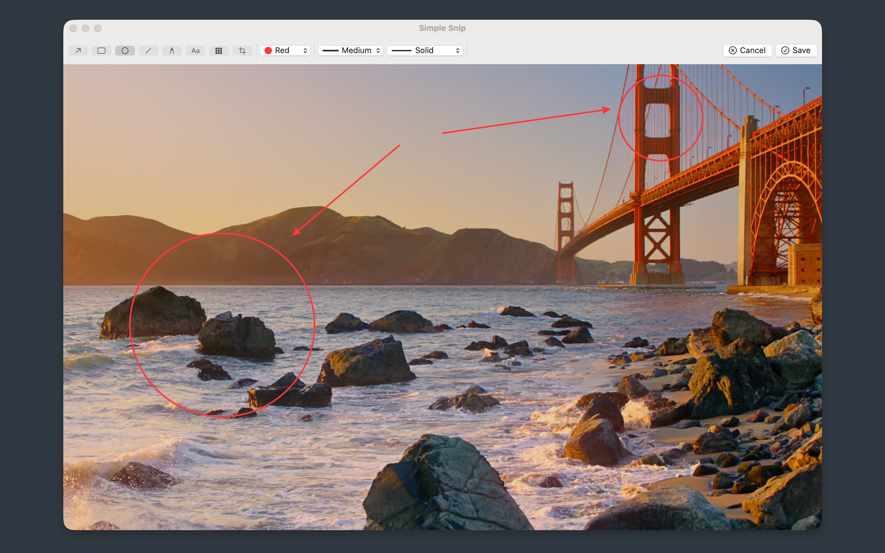
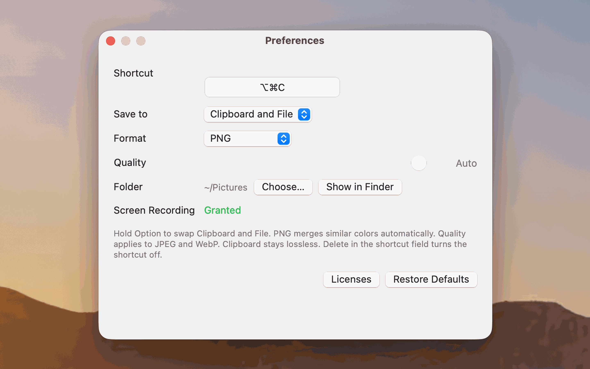

# Simple Snip

A minimal macOS screenshot app. It runs natively on Apple silicon, does not need a network connection, and only takes screenshots.

Press ⌘⌥C, or open it from the menu bar. Drag a region or click a window, annotate, then save to the clipboard, a file, or both.





## English

- **Platform**: macOS 12+
- **Bundle ID**: `com.cloudcr.simplescreenshot`
- **Interface**: menu bar only, no Dock icon
- **Active version**: `swift-version/` (Swift, AppKit, Core Graphics)

Screen Recording permission is required. The app does not collect data.

### Run

```bash
cd swift-version
./run.sh
```

`run.sh` builds a release binary and launches `Simple Snip.app`. The first launch needs Screen Recording permission in System Settings. After you grant it, quit and open the app again.

### Docs

- `docs/spec.md` — product and technical spec
- `docs/app-store.md` — App Store listing copy
- `docs/region-capture-coordinates.md` — macOS capture coordinates

`tauri-version/` is an archived Tauri prototype and is not the shipping app.

## 中文

极简 macOS 截图工具。为 Apple 芯片原生开发，不需要联网，只做截图。

按 ⌘⌥C，或从菜单栏打开。拖选区域或单击窗口，标注后保存到剪贴板、文件，或两者都保存。

- **平台**：macOS 12+
- **Bundle ID**：`com.cloudcr.simplescreenshot`
- **界面**：仅菜单栏，无 Dock 图标
- **当前版本**：`swift-version/`（Swift、AppKit、Core Graphics）

截取屏幕需要「屏幕录制」权限。应用不收集数据。

### 运行

```bash
cd swift-version
./run.sh
```

`run.sh` 会编译 release 并启动 `Simple Snip.app`。首次打开需要在系统设置里允许屏幕录制。允许之后退出再打开一次。

### 文档

- `docs/spec.md` — 产品与技术规格
- `docs/app-store.md` — App Store 商店文案
- `docs/region-capture-coordinates.md` — macOS 截图坐标说明

`tauri-version/` 是已归档的 Tauri 原型，不是正在发布的应用。
