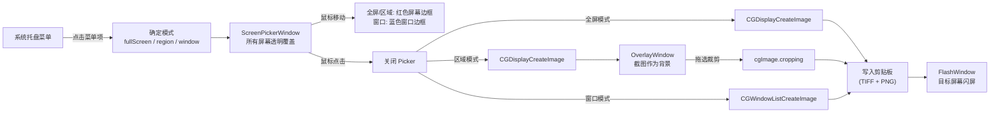

# Mac Screenshot — 产品与技术规格

## 概述

极简 macOS 截图工具。应用启动后仅在系统菜单栏显示托盘图标，通过托盘菜单触发全屏、区域或窗口截图，截图结果写入系统剪贴板。

- **平台**：macOS 12+
- **技术栈**：Swift + AppKit + Core Graphics
- **运行形态**：无主窗口、无 Dock 图标（`LSUIElement` + `setActivationPolicy(.accessory)`）

## 功能清单

| 功能 | 说明 |
|------|------|
| 全屏截图 | 选屏 → 立即截取整屏 → 写入剪贴板 |
| 区域截图 | 选屏 → 立即截取整屏 → 在静态截图上拖选裁剪 → 写入剪贴板 |
| 窗口截图 | 鼠标悬停高亮窗口（蓝色边框）→ 点击截取完整窗口（含阴影）→ 写入剪贴板 |
| 多屏幕支持 | 鼠标移动选屏（红色边框提示），点击确认目标屏幕 |
| 系统托盘 | 菜单栏右侧图标，菜单项：Full Screen / Region / Window / Quit |
| 闪屏反馈 | 截图成功后在目标屏幕显示白色闪光（模拟快门） |

## 技术架构



## 交互流程

### 选屏阶段（三种模式共用）

1. 用户点击托盘菜单 **Capture Full Screen**、**Capture Region** 或 **Capture Window**
2. 所有屏幕覆盖近透明窗口（`alpha: 0.001`，不改变当前活跃窗口状态）
3. 全屏/区域模式：鼠标所在屏幕显示红色边框；窗口模式：鼠标下的窗口显示蓝色边框
4. 鼠标左键点击确认

### 全屏截图

5. 关闭所有选屏窗口
6. 立即 `CGDisplayCreateImage(displayID)` 截取目标屏幕
7. 写入剪贴板（TIFF + PNG 双格式）
8. 在目标屏幕显示闪屏动画

### 区域截图

5. 关闭所有选屏窗口
6. 立即 `CGDisplayCreateImage(displayID)` 截取目标屏幕
7. 在目标屏幕打开 OverlayWindow，以截取的图片作为背景
8. 用户拖拽选区（选区外半透明蒙版，选区内显示原图）
9. 松开鼠标：`cgImage.cropping(to: scaledRect)` 裁剪
10. 写入剪贴板 → 闪屏
11. 按 Esc 取消

> 区域截图本质上是全屏截图的裁剪操作。截图在选屏确认时已完成，用户在静态图上拖选，确保截到的是真实屏幕内容（包括活跃窗口状态、菜单栏等）。

### 窗口截图

5. 关闭所有选屏窗口
6. `CGWindowListCreateImage(.null, .optionIncludingWindow, windowID, [.bestResolution])` 截取目标窗口（含阴影）
7. 写入剪贴板 → 闪屏

> 窗口检测使用 `CGWindowListCopyWindowInfo` 获取屏幕上所有可见窗口列表（按 Z 序排列），过滤掉自身 PID 和非普通窗口（layer != 0），取第一个包含鼠标位置的窗口。

## 坐标系

- **OverlayView**：`isFlipped = true`，坐标原点在左上角，Y 轴向下
- **CG Display 坐标**：`CGDisplayCreateImage(rect:)` 使用左上角原点，与 flipped NSView 坐标一致
- **Retina 缩放**：`CGDisplayCreateImage` 返回像素尺寸的 CGImage，裁剪时需将 points 坐标乘以 `screen.backingScaleFactor`
- **AppKit vs Quartz**：`NSEvent.mouseLocation` 使用 AppKit 坐标（主屏左下角原点），`kCGWindowBounds` 使用 Quartz 坐标（主屏左上角原点），转换公式：`quartz_y = mainScreenHeight - appkit_y`

## 项目结构

```
mac-screenshot/
├── docs/
│   └── spec.md                         # 本文档
├── swift-version/                      # Swift 原生版本（活跃开发）
│   ├── Package.swift                   # SPM 配置
│   ├── Sources/MacScreenshot/
│   │   ├── main.swift                  # 入口：NSApplication + 隐藏 Dock
│   │   ├── AppDelegate.swift           # 托盘菜单 + 选屏/截图流程编排
│   │   ├── ScreenCapture.swift         # CGDisplayCreateImage 截屏 + 裁剪 + 剪贴板
│   │   ├── ScreenPickerWindow.swift    # 选屏透明窗口
│   │   ├── ScreenPickerView.swift      # 选屏红色边框 / 窗口蓝色边框绘制
│   │   ├── WindowPicker.swift          # 窗口检测（CGWindowListCopyWindowInfo）+ 截取
│   │   ├── OverlayWindow.swift         # 区域选区窗口（背景为已截图片）
│   │   ├── OverlayView.swift           # 选区绘制（蒙版 + 拖拽 + 尺寸信息）
│   │   └── FlashWindow.swift           # 截图成功闪屏
│   ├── run.sh                          # 编译 + 打包 .app + 运行
│   └── README.md
└── tauri-version/                      # Tauri 版本（已归档）
    └── ...
```

## 关键设计决策

| 决策 | 原因 |
|------|------|
| 选屏时不激活 app（不调用 `NSApp.activate`） | 保持其他窗口的焦点状态，截图反映真实屏幕 |
| `acceptsFirstMouse` 返回 true | 非活跃 app 时首次点击直接作为 mouseDown 传递 |
| 选屏确认后立即截图，区域模式在静态图上裁剪 | 避免覆盖窗口被截入，确保截到实时屏幕内容 |
| 窗口背景 `alpha: 0.001` 而非完全透明 | macOS 不向完全透明窗口传递鼠标事件 |
| 剪贴板同时写入 TIFF + PNG | 兼容不同应用的粘贴格式需求 |
| 窗口截图使用 `CGWindowListCreateImage` | 单独截取指定窗口（含阴影），不受其他窗口遮挡影响 |
| 窗口检测过滤 layer != 0 | 只选择普通窗口，排除菜单栏、Dock 等系统 UI |

## 已知限制

- **屏幕录制权限**：首次使用需在「系统设置 → 隐私与安全性 → 屏幕录制」中手动添加 app 并授权
- **开发模式 Dock 可见**：`LSUIElement` 在 run.sh 打包的 .app 中生效；直接运行二进制时 Dock 可能显示图标
- **选屏阶段不支持键盘**：为避免 `NSApp.activate` 改变活跃窗口状态，选屏仅通过鼠标操作
- **保存到文件**：尚未实现，当前仅写入剪贴板
