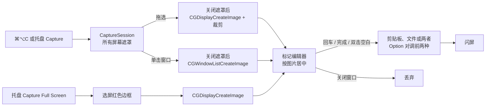

# Simple Screenshot — 产品与技术规格

## 概述

极简 macOS 截图工具 Simple Screenshot，用来替代已停更、仅有 Intel 版本的 Snip。只做截图和标注，不含滚动截屏等复杂功能。应用启动后仅在系统菜单栏显示托盘图标。默认用全局快捷键调起一次截图：拖选区域，或悬停窗口后单击。截图落在选区上的标记编辑器里，确认后按偏好设置写入剪贴板、文件，或两者都写。

- **平台**：macOS 12+
- **Bundle ID**：`com.cloudcr.simplescreenshot`
- **技术栈**：Swift + AppKit + Core Graphics
- **运行形态**：无主窗口、无 Dock 图标（`LSUIElement` + `setActivationPolicy(.accessory)`）

## 功能清单

| 功能 | 说明 |
|------|------|
| 快捷键截图 | 默认 ⌘⌥C。拖选时用蓝白对比边框和角点标出选区；悬停窗口为蓝色边框，单击截取。预览窗口按图片尺寸在屏幕正中打开；图片窄于工具栏时窗口加宽到能放下工具栏，图片仍按原比例居中 |
| 全屏截图 | 菜单单独入口：选屏（红色边框）→ 截取整屏 → 标记编辑器 |
| 标记编辑器 | 箭头/矩形/椭圆/直线/手绘/文字/马赛克/裁剪。可调颜色、线宽、虚线、字体。选中后可移动、缩放、删除。回车、完成按钮，或箭头工具下双击空白处确认 |
| 保存 | 偏好设置可选剪贴板、文件，或两者都保存（文件默认在「图片」）。用户另选的目录会存成安全作用域书签，供沙盒版下次写入。文件格式默认是自动减色的 PNG，也可选无损 PNG、JPEG、WebP。JPEG 和 WebP 可设质量，默认 90%。剪贴板始终是无损 TIFF + PNG。确认时按住 Option，在剪贴板和文件之间对调；已选两者都保存时不变。直接关窗口则丢弃 |
| 偏好设置 | 快捷键（Delete 关闭热键）、保存去向、文件格式与质量、保存目录。Show in Finder 用访达打开保存目录。每次打开设置都检查屏幕录制权限：已授权显示绿色 Granted，未授权显示橙色 Not granted，并可 Grant Access 打开系统设置。Licenses 展示 libwebp 许可。Restore Defaults 恢复为 ⌘⌥C、剪贴板、减色 PNG、质量 90%、「图片」 |
| 多屏幕支持 | 遮罩覆盖所有屏幕；拖选限制在按下鼠标的那一块屏幕上 |
| 系统托盘 | 菜单栏图标。菜单：Capture / Capture Full Screen / Preferences… / Quit |
| 闪屏反馈 | 确认并成功写出之后，在目标屏幕显示白色闪光 |

## 技术架构



## 交互流程

### 快捷键截图

1. 按下快捷键（默认 ⌘⌥C；在偏好设置里删除后不再响应）或托盘 **Capture**。标注窗口已打开时忽略，避免冲掉未确认的标记
2. 先拍下各屏画面，再盖上不透明遮罩（内容是刚拍下的画面）。然后激活应用，使点击和 Esc 能送到遮罩
3. 鼠标移动：悬停的普通窗口显示蓝色边框。拖拽：在按下鼠标的那块屏幕上画出选区
4. 松开时移动距离小于 5pt，且鼠标下有窗口：截取该窗口。没有窗口则保持遮罩
5. 拖选松开，或单击窗口：从按下快捷键时拍下的画面里裁出对应区域
6. Esc 取消

> 窗口检测使用 `CGWindowListCopyWindowInfo`（按 Z 序），过滤自身 PID 和 `layer != 0`，取第一个包含鼠标位置的窗口。窗口图用 `CGWindowListCreateImage(.optionIncludingWindow, .bestResolution)`，含阴影。

### 全屏截图

1. 托盘 **Capture Full Screen**
2. 所有屏幕近透明覆盖，鼠标所在屏幕显示红色边框，点击确认
3. 关闭选屏窗口，约 50ms 后 `CGDisplayCreateImage`

### 确认与保存

编辑器里回车、点完成，或在箭头工具下双击空白，才写出结果。去向可以是剪贴板、文件，或两者。按住 Option 时，剪贴板与文件对调；已选两者都保存时仍写两处。文件默认放在「图片」，文件名 `Screenshot yyyy-MM-dd at HH.mm.ss`，扩展名随格式变化（`.png` / `.jpg` / `.webp`）。用户另选目录时保存安全作用域书签。默认 PNG 会把相近颜色合并成最多 256 色的索引图，并保留透明；颜色本来就不超过 256 时仍然无损。减色后体积没有变小则改写无损 PNG。无损 PNG 保持每个像素。JPEG 和 WebP 使用质量滑杆，默认 90%。剪贴板不跟随文件格式，始终写无损 TIFF + PNG。直接关闭窗口则丢弃。成功写出后闪屏。保存按钮是窗口的首选按钮。

### 标记编辑器

截图完成后自动打开标记编辑器窗口（`AnnotationEditorWindow`）：

1. 窗口按图片比例放在屏幕正中。图片大于可见区域 90% 时等比缩小；画布与图片显示范围一致，没有滚动条。图片宽于工具栏时四周不留空白。图片窄于工具栏时，窗口加宽到能完整显示工具栏，图片按原比例居中，两侧为窗口底色。窗口不可再拖大。
2. 顶部工具栏（`AnnotationToolbar`）：
   - 工具：箭头 / 矩形 / 椭圆 / 直线 / 手绘 / 文字 / 马赛克 / 裁剪
   - 颜色：红 / 蓝 / 绿 / 黄 / 黑 / 白
   - 线宽：细(1) / 中(2.5) / 粗(5)；虚线样式：实线 / 虚线 / 点线 / 点划线（按线宽与图形类型缩放）
   - 文字选项（文字工具激活时）：字体（System/Mono/Serif）、字号（12/16/24/36）、粗体/斜体
   - 裁剪比例（裁剪工具激活时）：Free、16:9、4:3、1:1、3:2、2:3
   - 关闭（丢弃）/ 保存按钮。Esc 与关闭按钮相同，丢弃本次截图并关闭预览。修改颜色/线宽/虚线/字体等时立即应用到当前选中或编辑中的标记
3. 画布（`AnnotationCanvas`，`isFlipped = true`）：
   - 背景为截图原图
   - 鼠标交互状态机：idle → drawing / selected → moving / resizing / editingText
   - 选中标记显示 8 个缩放手柄，支持拖动缩放
   - Delete 键删除选中标记，Cmd+Z 撤销。Esc 与关闭按钮相同，丢弃本次截图并关闭预览，不写入剪贴板或文件
   - 裁剪工具：拖选区域，松开进入预览（选区高亮、其他变暗）；双击或回车确认裁剪；裁剪后更新画布尺寸、背景图，标注坐标平移、完全在裁剪区外的标注移除，并切回箭头工具
4. 确认时：无论有没有标记，都在原图像素坐标中渲染合成图，再按偏好设置写出。直接关闭窗口则什么都不写

> 合成渲染使用与原图同尺寸的 `CGContext`，先绘制原图，再按缩放因子将标记绘制到像素空间。`NSGraphicsContext` 使用 `flipped: true` 确保文字方向正确。
>
> 马赛克工具：操作类似手绘画笔，沿鼠标轨迹涂抹。mouseUp 时裁剪路径覆盖区域的背景图，经 `CIPixellate` 像素化后用笔刷路径做 clip mask，生成预渲染图。笔刷宽度由线宽映射（细→16px / 中→28px / 粗→44px）。

## 坐标系

- **截图遮罩 / 标记画布**：`isFlipped = true`，坐标原点在左上角，Y 轴向下
- **CG Display 坐标**：`CGDisplayCreateImage(rect:)` 使用左上角原点，与 flipped NSView 坐标一致
- **Retina 缩放**：`CGDisplayCreateImage` 返回像素尺寸的 CGImage，裁剪时需将 points 坐标乘以 `screen.backingScaleFactor`
- **AppKit vs Quartz**：`NSEvent.mouseLocation` 使用 AppKit 坐标（主屏左下角原点），`kCGWindowBounds` 使用 Quartz 坐标（主屏左上角原点），转换公式：`quartz_y = mainScreenHeight - appkit_y`

## 项目结构

```
mac-screenshot/
├── docs/
│   └── spec.md                         # 本文档
├── swift-version/                      # Swift 原生版本（活跃开发）
│   ├── Package.swift                   # SPM 配置
│   ├── MacScreenshot.xcodeproj         # App Store 归档工程，开启沙盒
│   ├── App/                            # Info.plist、权限、图标、许可证、隐私清单
│   ├── Vendor/libwebp/                 # libwebp 1.5.0，仅用于写出 WebP
│   ├── Sources/MacScreenshot/
│   │   ├── main.swift                  # 入口：NSApplication + 隐藏 Dock
│   │   ├── AppDelegate.swift           # 托盘菜单 + 选屏/截图流程编排
│   │   ├── ScreenCapture.swift         # 截屏、裁剪、剪贴板与保存文件
│   │   ├── ImageFileWriter.swift       # PNG 减色、无损 PNG、JPEG、WebP（WebP 用 libwebp，系统 ImageIO 不能写）
│   │   ├── ScreenPickerWindow.swift    # 选屏透明窗口
│   │   ├── ScreenPickerView.swift      # 选屏红色边框 / 窗口蓝色边框绘制
│   │   ├── WindowPicker.swift          # 窗口检测（CGWindowListCopyWindowInfo）+ 截取
│   │   ├── CaptureSession.swift        # 快捷键截图遮罩：拖选区域 / 单击窗口
│   │   ├── HotKeyCenter.swift          # Carbon 全局热键
│   │   ├── Preferences.swift           # 快捷键、保存去向、格式、质量、目录
│   │   ├── PreferencesWindow.swift     # 偏好设置窗口
│   │   ├── FlashWindow.swift           # 确认成功后闪屏
│   │   ├── Annotation.swift            # 标记数据模型 + 绘制/命中检测
│   │   ├── AnnotationToolbar.swift     # 标记工具栏 UI
│   │   ├── AnnotationCanvas.swift      # 标记画布交互（绘制/选中/移动/缩放/文字编辑）
│   │   └── AnnotationEditorWindow.swift # 标记编辑器窗口 + 合成渲染
│   ├── run.sh                          # 编译 + 打包为 Simple Screenshot.app + 运行
│   └── README.md
└── tauri-version/                      # Tauri 版本（已归档）
    └── ...
```

## 关键设计决策

| 决策 | 原因 |
|------|------|
| 快捷键按下后先截屏，再激活应用 | 激活才能收到点击和 Esc；画面用的是激活前的快照，不会把失焦状态拍进去 |
| 遮罩窗口设为不透明 | 透明像素上的点击会被系统穿透到下层窗口，导致点了没反应 |
| 全局热键用 Carbon `RegisterEventHotKey` | 不需要辅助功能权限，而且会吃掉按键，不会传给前台应用 |
| 确认后才写出，Option 对调剪贴板与文件 | 标注完成前不污染剪贴板；两者都保存时 Option 不改变去向 |
| 全屏选屏窗口背景 `alpha: 0.001` | macOS 不向完全透明窗口传递鼠标事件。快捷键遮罩则绘制 0.28 暗色，选区挖空 |
| 剪贴板同时写入 TIFF + PNG | 兼容不同应用的粘贴格式需求。剪贴板始终无损，不跟随文件格式 |
| 默认 PNG 做减色而不是固定质量百分比 | 界面截图颜色少，合并相近色就能明显缩小，文字也不像 JPEG 那样发糊。质量滑杆只留给 JPEG 和 WebP |
| WebP 用内置 libwebp 编码 | 当前系统的 ImageIO 能写 JPEG，但不能创建 WebP 目标 |
| 默认保存到「图片」，另选目录用安全作用域书签 | App Store 沙盒不能按普通路径写任意文件夹。「图片」有对应权限；其他目录要用户选一次并记住书签 |
| 窗口截图使用 `CGWindowListCreateImage` | 单独截取指定窗口（含阴影），不受其他窗口遮挡影响 |
| 窗口检测过滤 layer != 0 | 只选择普通窗口，排除菜单栏、Dock 等系统 UI |
| 编辑器窗口临时切换 `.regular` 激活策略 | agent app（`.accessory`）无法正常显示窗口，编辑器打开时切 `.regular`，关闭时切回 |
| 合成渲染 `NSGraphicsContext(flipped: true)` | 确保文字绘制方向与 canvas 一致，避免手动 Y 翻转导致文字上下颠倒 |

## 已知限制

- **屏幕录制权限**：应用不能自己打开开关。设置里的 Grant Access 会先申请权限，再打开「系统设置 → 隐私与安全性 → 屏幕录制」。用户打开开关后，系统通常要求退出并重新打开应用
- **沙盒保存目录**：`run.sh` 开发包不开沙盒。上架包开启沙盒后，未选过的自定义目录写不进去，需要在设置里重新 Choose 一次
- **开发模式 Dock 可见**：`LSUIElement` 在 run.sh 打包的 .app 中生效；直接运行二进制时 Dock 可能显示图标。打开编辑器或偏好设置时会临时变为普通应用，以便显示窗口
- **全屏选屏仍不抢焦点**：快捷键截图会在快照之后激活应用；菜单里的全屏选屏仍避免 `NSApp.activate`
- **不做滚动截屏、多选标记、重做**
