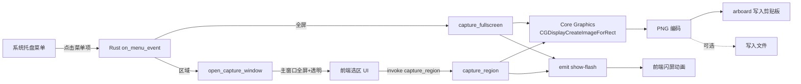

# Mac Screenshot — 产品与技术规格

## 概述

极简 macOS 截图工具。应用启动后仅在系统菜单栏显示托盘图标，通过托盘菜单触发全屏或区域截图，截图结果写入系统剪贴板。

- **平台**：macOS 10.15+
- **技术栈**：Tauri 2 (Rust) + Vite (HTML/JS) + Core Graphics 原生截屏
- **运行形态**：无主窗口、无 Dock 图标（打包后通过 `LSUIElement` 实现）

## 功能清单

| 功能 | 说明 |
|------|------|
| 全屏截图 | 截取主显示器整屏，写入剪贴板 |
| 区域截图 | 全屏半透明蒙版 → 拖拽选区 → 截取选区内容 → 写入剪贴板 |
| 系统托盘 | 菜单栏右侧图标，菜单项：Capture Full Screen / Capture Region / Quit |
| 闪屏反馈 | 截图成功后全屏白色闪光（模拟快门），提示用户操作已完成 |
| 保存到文件 | 后端接口已预留 `save_to_file` 参数，UI 尚未实现 |

## 技术架构



## 交互流程

### 全屏截图

1. 用户点击托盘菜单 **Capture Full Screen**
2. Rust 调用 `CGDisplayCreateImageForRect` 截取主屏全部区域
3. PNG 编码 → BGRA 转 RGBA → `arboard` 写入系统剪贴板
4. 主窗口临时全屏显示，触发白色闪屏动画（0.5s），随后隐藏

### 区域截图

1. 用户点击托盘菜单 **Capture Region**
2. 保存主窗口当前状态，将其设为全屏、无边框、透明背景，并 `show()`
3. 前端显示半透明蒙版（`rgba(0,0,0,0.35)`）+ 十字光标
4. 用户拖拽鼠标画出矩形，实时显示选区框和尺寸信息
5. 松开鼠标（或按 Enter）：
   - 隐藏蒙版、选区框、尺寸信息（避免被截入）
   - 等待两帧 + 50ms 确保合成器更新
   - 调用 `capture_region`，Rust 端再等 80ms 后截屏
6. 截图成功 → 写入剪贴板 → 触发闪屏 → 350ms 后退出选区模式 → 隐藏主窗口
7. 按 Esc 取消选区，直接退出

## 坐标系

前端 WebView 坐标（CSS pixels）与 macOS 逻辑坐标（points）一致，全屏窗口从 `(0, 0)` 覆盖主屏，因此前端 `clientX/clientY` 可直接作为 `CGDisplayCreateImageForRect` 的输入坐标。

- **坐标原点**：屏幕左上角
- **Y 轴方向**：向下
- **单位**：逻辑像素（points），Retina 屏上 1 point = 2 物理像素，CG API 内部处理缩放

> 注意：`CGDisplayCreateImageForRect` 使用 Quartz Display Space（左上角原点），与 Quartz 2D 绘图坐标系（左下角原点）不同，无需翻转 Y 轴。

## 项目结构

```
mac-screenshot/
├── index.html          # 主页面（主视图 + 选区视图 + 闪屏层）
├── index.js            # 前端逻辑（选区交互、事件监听、invoke 调用）
├── capture.html/js     # 早期独立选区页（已废弃，逻辑合并至 index.*）
├── vite.config.js      # Vite 配置
├── package.json        # npm 脚本与依赖
├── docs/
│   ├── spec.md         # 本文档
│   └── region-capture-coordinates.md  # 坐标系详细说明
├── src-tauri/
│   ├── tauri.conf.json # Tauri 配置（窗口、打包、权限）
│   ├── Cargo.toml      # Rust 依赖
│   ├── Info.plist      # macOS LSUIElement（隐藏 Dock）
│   ├── capabilities/   # IPC 命令权限声明
│   ├── src/
│   │   ├── lib.rs      # 应用入口、菜单/托盘、窗口管理、IPC 命令
│   │   └── capture_macos.rs  # Core Graphics 截屏 + PNG 编码
│   └── icons/          # 多尺寸应用图标
└── scripts/
    └── generate-icon.js  # 图标生成脚本
```

## IPC 命令

| 命令 | 参数 | 说明 |
|------|------|------|
| `capture_region` | `region: {x, y, width, height}`, `save_to_file?: string` | 区域截图 → 剪贴板 |
| `capture_fullscreen` | `save_to_file?: string` | 全屏截图 → 剪贴板 |
| `close_capture_window` | 无 | 取消选区，退出选区模式 |
| `get_debug_log_path` | 无 | 返回调试日志文件路径 |
| `log_from_frontend` | `message: string` | 前端写入调试日志 |

## 已知限制

- **仅主显示器**：当前只截取 `CGDisplay::main()` 的内容，不支持多显示器选择
- **屏幕录制权限**：首次使用需在「系统设置 → 隐私与安全性 → 屏幕录制」中授权
- **开发模式 Dock 可见**：`LSUIElement` 仅在打包后的 `.app` 中生效，`tauri dev` 运行时 Dock 仍会显示图标
- **保存到文件**：后端已支持 `save_to_file` 参数，但前端 UI（保存对话框/路径选择）尚未实现
- **选区 UI 会被截入的规避**：截图前隐藏所有蒙版/选区框/提示信息，并延迟等待合成器更新
