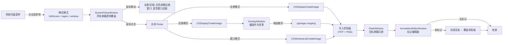

# Mac Screenshot — 产品与技术规格

## 概述

极简 macOS 截图工具。应用启动后仅在系统菜单栏显示托盘图标，通过托盘菜单触发全屏、区域或窗口截图，截图完成后打开标记编辑器进行标注，最终结果写入系统剪贴板。

- **平台**：macOS 12+
- **技术栈**：Swift + AppKit + Core Graphics
- **运行形态**：无主窗口、无 Dock 图标（`LSUIElement` + `setActivationPolicy(.accessory)`）

## 功能清单

| 功能 | 说明 |
|------|------|
| 全屏截图 | 选屏 → 立即截取整屏 → 标记编辑器 → 写入剪贴板 |
| 区域截图 | 选屏 → 立即截取整屏 → 在静态截图上拖选裁剪 → 标记编辑器 → 写入剪贴板 |
| 窗口截图 | 鼠标悬停高亮窗口（蓝色边框）→ 点击截取完整窗口（含阴影）→ 标记编辑器 → 写入剪贴板 |
| 标记编辑器 | 截图后弹出，支持箭头/矩形/椭圆/直线/手绘/文字/马赛克标注，可调颜色/线宽/字体，支持选中/移动/缩放/删除，关闭时合成覆盖剪贴板 |
| 多屏幕支持 | 鼠标移动选屏（红色边框提示），点击确认目标屏幕 |
| 系统托盘 | 菜单栏右侧图标，菜单项：Full Screen / Region / Window / Quit |
| 闪屏反馈 | 截图成功后在目标屏幕显示白色闪光（模拟快门） |

## 技术架构



## 交互流程

### 选屏阶段（三种模式共用）

1. 用户点击托盘菜单 **Capture Full Screen**、**Capture Region** 或 **Capture Window**
2. 所有屏幕覆盖近透明窗口（`alpha: 0.001`，不改变当前活跃窗口状态）
3. 全屏/区域模式：鼠标所在屏幕显示红色边框；窗口模式：鼠标下的窗口显示蓝色边框
4. 鼠标左键点击确认

### 全屏截图

5. 关闭所有选屏窗口
6. 立即 `CGDisplayCreateImage(displayID)` 截取目标屏幕
7. 写入剪贴板（TIFF + PNG 双格式）→ 闪屏 → 打开标记编辑器

### 区域截图

5. 关闭所有选屏窗口
6. 立即 `CGDisplayCreateImage(displayID)` 截取目标屏幕
7. 在目标屏幕打开 OverlayWindow，以截取的图片作为背景
8. 用户拖拽选区（选区外半透明蒙版，选区内显示原图）
9. 松开鼠标：`cgImage.cropping(to: scaledRect)` 裁剪
10. 写入剪贴板 → 闪屏 → 打开标记编辑器
11. 按 Esc 取消

> 区域截图本质上是全屏截图的裁剪操作。截图在选屏确认时已完成，用户在静态图上拖选，确保截到的是真实屏幕内容（包括活跃窗口状态、菜单栏等）。

### 窗口截图

5. 关闭所有选屏窗口
6. `CGWindowListCreateImage(.null, .optionIncludingWindow, windowID, [.bestResolution])` 截取目标窗口（含阴影）
7. 写入剪贴板 → 闪屏 → 打开标记编辑器

> 窗口检测使用 `CGWindowListCopyWindowInfo` 获取屏幕上所有可见窗口列表（按 Z 序排列），过滤掉自身 PID 和非普通窗口（layer != 0），取第一个包含鼠标位置的窗口。

### 标记编辑器

截图完成后自动打开标记编辑器窗口（`AnnotationEditorWindow`）：

1. 窗口尺寸适配截图大小，限制不超过屏幕 80%
2. 顶部工具栏（`AnnotationToolbar`）：
   - 工具：箭头 / 矩形 / 椭圆 / 直线 / 手绘 / 文字 / 马赛克
   - 颜色：红 / 蓝 / 绿 / 黄 / 黑 / 白
   - 线宽：细(1) / 中(2.5) / 粗(5)；虚线样式：实线 / 虚线 / 点线 / 点划线（按线宽与图形类型缩放）
   - 文字选项（文字工具激活时）：字体（System/Mono/Serif）、字号（12/16/24/36）、粗体/斜体
   - 关闭（丢弃）/ 保存（写入剪贴板）按钮；修改颜色/线宽/虚线/字体等时立即应用到当前选中或编辑中的标记
3. 画布（`AnnotationCanvas`，`isFlipped = true`）：
   - 背景为截图原图
   - 鼠标交互状态机：idle → drawing / selected → moving / resizing / editingText
   - 选中标记显示 8 个缩放手柄，支持拖动缩放
   - Delete 键删除选中标记，Cmd+Z 撤销；Esc：编辑文字时取消编辑，有选中时取消选中，否则切回箭头工具（编辑态用 keyDown 本地监控；非编辑态、焦点在工具栏时用窗口级 key 监控，确保文字工具也能退回箭头）
4. 关闭窗口时：若有标记，在原图像素坐标中渲染合成图并覆盖剪贴板；无标记则保留原图

> 合成渲染使用与原图同尺寸的 `CGContext`，先绘制原图，再按缩放因子将标记绘制到像素空间。`NSGraphicsContext` 使用 `flipped: true` 确保文字方向正确。
>
> 马赛克工具：操作类似手绘画笔，沿鼠标轨迹涂抹。mouseUp 时裁剪路径覆盖区域的背景图，经 `CIPixellate` 像素化后用笔刷路径做 clip mask，生成预渲染图。笔刷宽度由线宽映射（细→16px / 中→28px / 粗→44px）。

## 坐标系

- **OverlayView**：`isFlipped = true`，坐标原点在左上角，Y 轴向下
- **CG Display 坐标**：`CGDisplayCreateImage(rect:)` 使用左上角原点，与 flipped NSView 坐标一致
- **Retina 缩放**：`CGDisplayCreateImage` 返回像素尺寸的 CGImage，裁剪时需将 points 坐标乘以 `screen.backingScaleFactor`
- **AppKit vs Quartz**：`NSEvent.mouseLocation` 使用 AppKit 坐标（主屏左下角原点），`kCGWindowBounds` 使用 Quartz 坐标（主屏左上角原点），转换公式：`quartz_y = mainScreenHeight - appkit_y`

## 项目结构

```
mac-screenshot/
├── docs/
│   └── spec.md                         # 本文档
├── swift-version/                      # Swift 原生版本（活跃开发）
│   ├── Package.swift                   # SPM 配置
│   ├── Sources/MacScreenshot/
│   │   ├── main.swift                  # 入口：NSApplication + 隐藏 Dock
│   │   ├── AppDelegate.swift           # 托盘菜单 + 选屏/截图流程编排
│   │   ├── ScreenCapture.swift         # CGDisplayCreateImage 截屏 + 裁剪 + 剪贴板
│   │   ├── ScreenPickerWindow.swift    # 选屏透明窗口
│   │   ├── ScreenPickerView.swift      # 选屏红色边框 / 窗口蓝色边框绘制
│   │   ├── WindowPicker.swift          # 窗口检测（CGWindowListCopyWindowInfo）+ 截取
│   │   ├── OverlayWindow.swift         # 区域选区窗口（背景为已截图片）
│   │   ├── OverlayView.swift           # 选区绘制（蒙版 + 拖拽 + 尺寸信息）
│   │   ├── FlashWindow.swift           # 截图成功闪屏
│   │   ├── Annotation.swift            # 标记数据模型 + 绘制/命中检测
│   │   ├── AnnotationToolbar.swift     # 标记工具栏 UI
│   │   ├── AnnotationCanvas.swift      # 标记画布交互（绘制/选中/移动/缩放/文字编辑）
│   │   └── AnnotationEditorWindow.swift # 标记编辑器窗口 + 合成渲染
│   ├── run.sh                          # 编译 + 打包 .app + 运行
│   └── README.md
└── tauri-version/                      # Tauri 版本（已归档）
    └── ...
```

## 关键设计决策

| 决策 | 原因 |
|------|------|
| 选屏时不激活 app（不调用 `NSApp.activate`） | 保持其他窗口的焦点状态，截图反映真实屏幕 |
| `acceptsFirstMouse` 返回 true | 非活跃 app 时首次点击直接作为 mouseDown 传递 |
| 选屏确认后立即截图，区域模式在静态图上裁剪 | 避免覆盖窗口被截入，确保截到实时屏幕内容 |
| 窗口背景 `alpha: 0.001` 而非完全透明 | macOS 不向完全透明窗口传递鼠标事件 |
| 剪贴板同时写入 TIFF + PNG | 兼容不同应用的粘贴格式需求 |
| 窗口截图使用 `CGWindowListCreateImage` | 单独截取指定窗口（含阴影），不受其他窗口遮挡影响 |
| 窗口检测过滤 layer != 0 | 只选择普通窗口，排除菜单栏、Dock 等系统 UI |
| 编辑器窗口临时切换 `.regular` 激活策略 | agent app（`.accessory`）无法正常显示窗口，编辑器打开时切 `.regular`，关闭时切回 |
| 合成渲染 `NSGraphicsContext(flipped: true)` | 确保文字绘制方向与 canvas 一致，避免手动 Y 翻转导致文字上下颠倒 |

## 已知限制

- **屏幕录制权限**：首次使用需在「系统设置 → 隐私与安全性 → 屏幕录制」中手动添加 app 并授权
- **开发模式 Dock 可见**：`LSUIElement` 在 run.sh 打包的 .app 中生效；直接运行二进制时 Dock 可能显示图标
- **选屏阶段不支持键盘**：为避免 `NSApp.activate` 改变活跃窗口状态，选屏仅通过鼠标操作
- **保存到文件**：尚未实现，当前仅写入剪贴板
